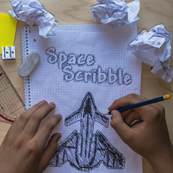

# SpaceScribble 

SpaceScribble is a popular and addictive space shooter for Windows Phone. It even got [reviewed by Windows Phone Central](https://www.windowscentral.com/spacescribble-windows-phone-space-combat-doodle-way) in March 2014.

    

Yet another wearisome lecture. Not again! You take your pencil and scribble some spaceships, planets and asteroids on your sketch block. Suddenly, your sketches become real! Is it a dream? So what! Take the challenge and become the ruler of your own universe!

You can get the app from the [Windows Store](http://windowsphone.com/s?appId=71fc4a5b-de12-4b28-88ec-8ac573ce9708).

### Features
- Challenging levels
- Smooth gameplay with 60 FPS
- Online leaderboards
- Unlockable spaceships
- Unique scribble style
- Touch and sensor controls
- Different weapons

### Reviews

What did users think about this app? Here are just a few out of **more than 2,000 reviews** with an outstanding average **4.6** ★ rating:

> "Great Game. My daughter & I love it. Thanks so much."
>
> _User, USA_

> "不错的游戏，六种机型，希望更多的机型出现"
>
> _作者为 用户, China_

> "Génial. Par contre comme beaucoup de jeu, en s' améliorant une partie devient longue..."
>
> _Utilisateur, France_

## License

This work is published under [MIT][mit] License.

[mit]: https://github.com/b3nk4n/spacescribble-game/blob/main/LICENSE
